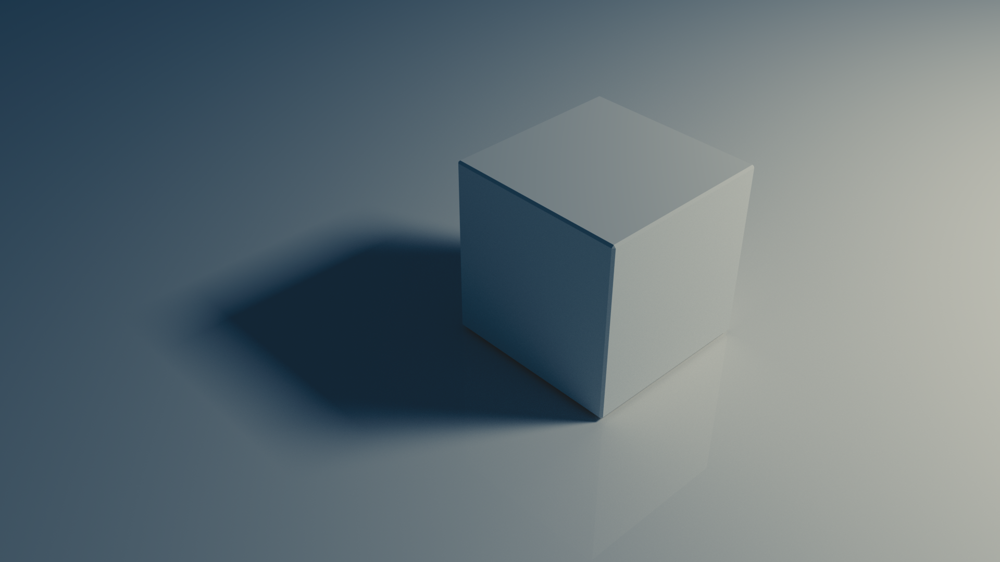

{:class="img-responsive"}

- talk about how we setup the lighting
- why we modeled the way we did

- then we can discuss the process I used to create the armour plating
- then talk about how I changed the materials
- then talk about how we updated the glowing so that it worked properly.

- talk about rendering settings?

(include any relevant screenshots from blender for the things that we adjusted)