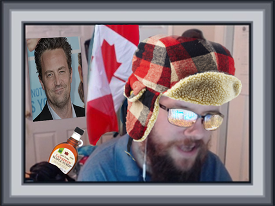
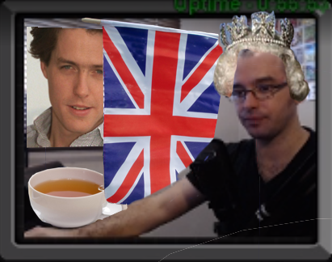
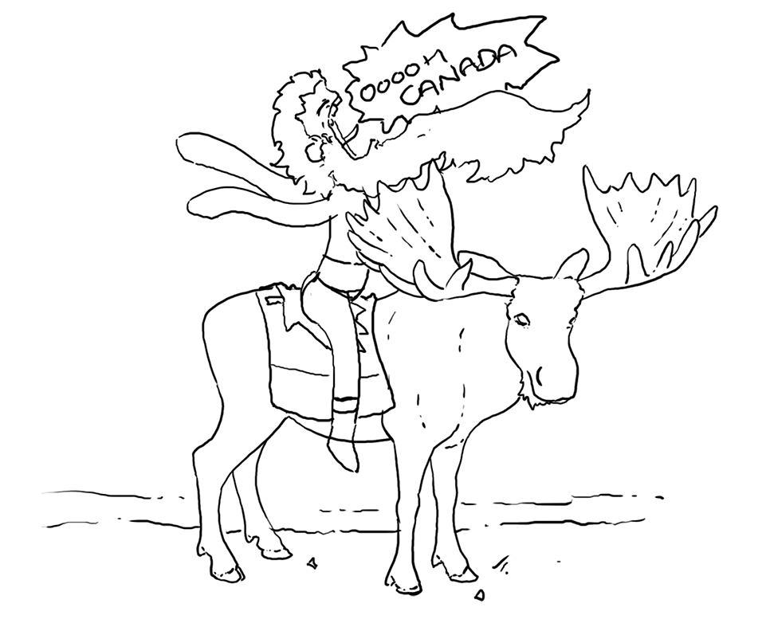
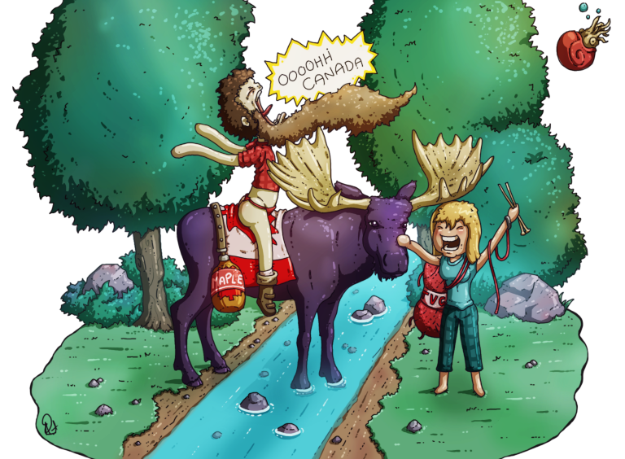
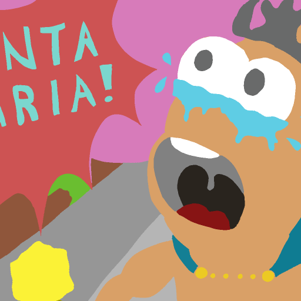
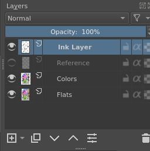
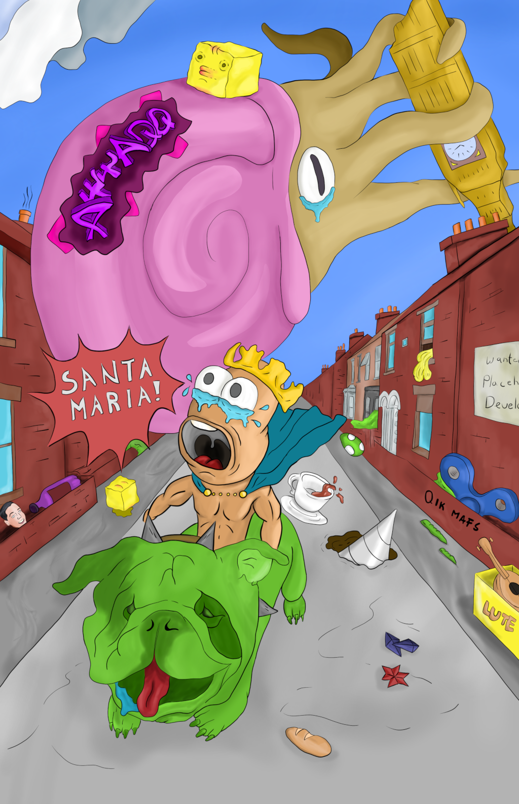

He may not be able to survive such a furious attaaqqq!!! This is the story of how it was done my friends .... it is marvelous indeed.

#### The backstory

One saturday many moons ago, a beautious wibblytroot was just hanging out programming video games on his twitch channel when suddenly there was a ferocious attaqq from [windybeardgames][1]. I was just sitting there minding my own troutiness when this HORRIFYING ATTAAQQQ was received.

{:width="512px"}

this of course was completely amazing and I was like .... NUUUUU this will not stand, I shall not allow this. So I naturally spent some time crafting my reply. It was a devastating counter attack!!! the windybeardgames may even have whincied slightly from its furious nature.

{:width="512px"}

windybeardgames is of course a man of such stature he was unable to let this stand. He responded almost immediate with a devastating counter attaqqq!!!! ....

{:width="512px"}

before I had a oppurtunity to properly respond to this aggression he crafted and even more complicated response, this volley was a massive undertaking, many chill streams were had during the color process. AND IT IS MARVELOUS IN ITS BEAUTY AND MIGHT!!!

{:width="768px"}

#### This ATTAQQ!!!!!

of course this could not stand, I mustered all my arting abilities to return fire ... and this is that story....

I mustered all of my arting ability together, and starting brainstorming in all available moments how I could top the majestic nature of this latest attaqq on my troutiness. THIS WOULD NOT STAND!!!!.

I decided to try to use a technical brush (g-pen) so that the linework could easily increase and decrease in width as I produced the lines. I really like this effect and I wanted to practice it.

I discovered that for the coloring process it was easiest to just use the airbrush on a low opacity settings. This allowed me to achieve the rendered final look by using the color picker tool and softly blending the colors around.

I wanted to try a new coloring technique that is similar to how comic books are colored. 

1. flatly color behind the line work using the lasso tool mostly to get the main coloring done.
2. you use the lasso tool to grab the flat color and then use a quick key to move it to a new layer and lock its alpha so that you can work on without disturbing the surrounding area.
3. then you use the lasso tool again in the new layer to select the areas you want to highlight or shadow and then can apply any coloring effects your interested in using.

{:width="512px"}

Using this technique I ended up finishing this drawing with 3 layers, the line-work, a flat color layer and a rendered color layer. The flat colored layer allowed me to select using the wand tool to isolate a color group.

{:width="256px"}

#### Failures

Unfortunately I discovered that it is extremely difficult to cell shade correctly without a really good internal sense for where lighting and shadow should fall. This meant that I eventually just ended up using the airbrush tool to render this image. This allowed me to 'fake' the shadowing a lot more easily because I could just push around the color until it looked sort of right instead of having to get it really dead on to start with.

#### Lessons Learned

One of the main lessons I learned is that creating a large image of this kind really can stretch the ability to do art and is pretty much a required part of my future art training. It makes me use all the skills I've been trying to build simultaneously. 

One of the main things I need to ensure I do next time is consistently shrinking the line weight the further away you get from the 
objects in the scene that are closest. I did this pretty inconsistently in this image mostly because I worked on it so much over the course of days that I forgot what I was doing between sessions. Consistency here is very important for a nice finished look.

I also learned that I am really weak on proper shadowing and highlight, because of this I have started practicing those skills specifically. I am doing real-life sketches of vegetables to help... EAT YOUR VEGETABLES!!!

I removed the krita quickkey for multi-brush because I kept bumping it and it was awful, I changed it to lasso tool because I actually wanted to use that tool a lot. I started using ctrl-shift-j a lot to grab the current selection and move it to a new layer. I then had to set the alpha lock manually. I would like to see if I can setup a macro that would do this automatically but was unable to find a way to do that easily in krita. I also use b and ctrl-shift-a a lot to change back to brush mode, and de-select everything. This is especially used after I move things to the new layer and lock the alpha.

#### Future ATTAQQ!!!!

There are plans, oh yes ... such plans I have. I am however waiting to see what windybeardgames does next. Such anticipation. In the meantime I am collecting my reference image library. I become more powerful every passing day. MWAHAHAHAHAHAHAHAHAHAHAHA.

{:width="1024px"}

[1]: http://www.windybeard.com/

